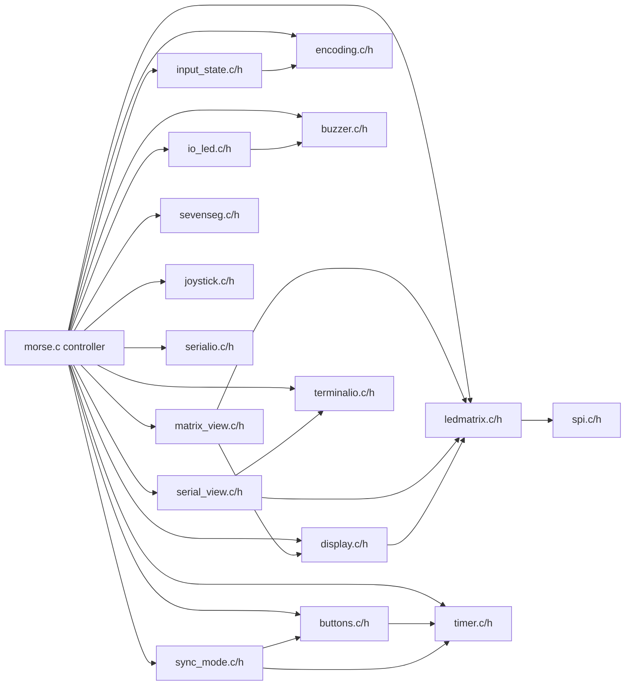
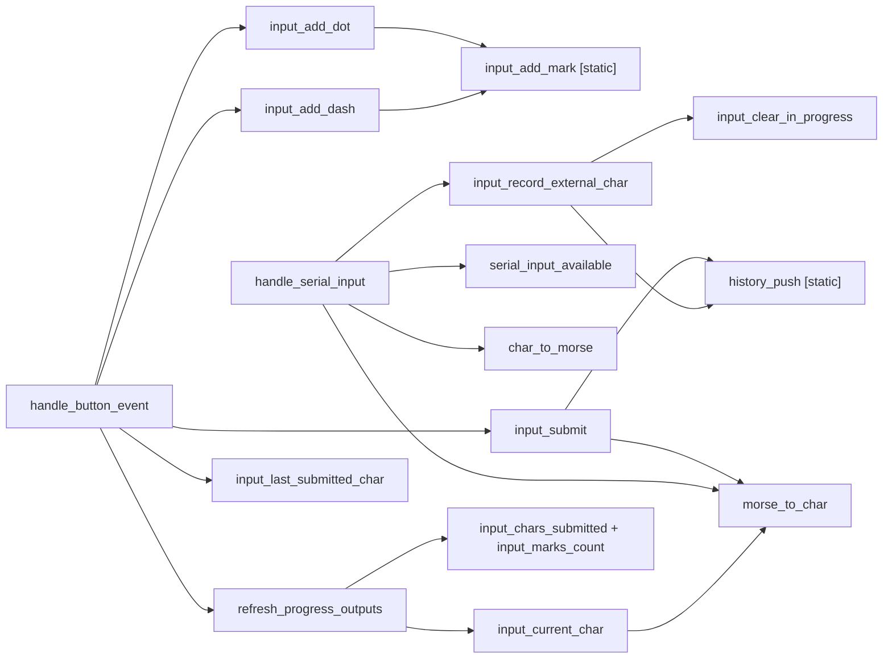
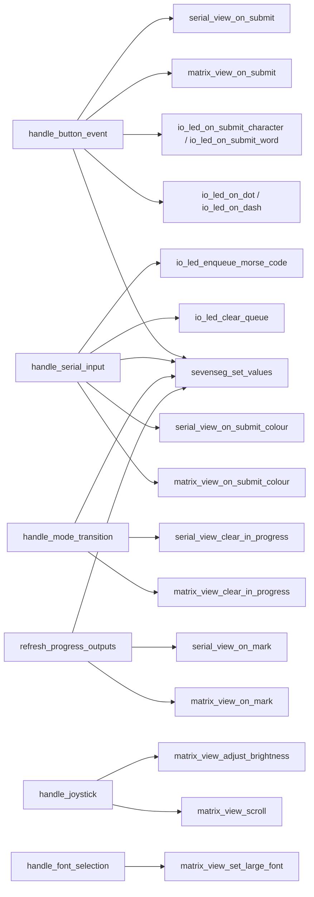
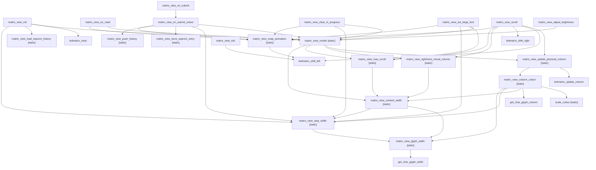
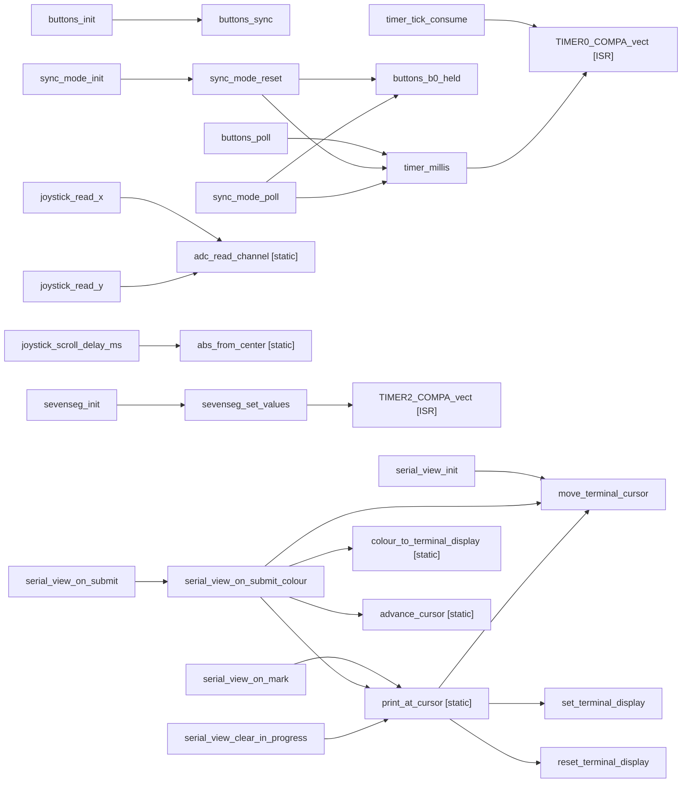

# Project Function Mindmaps

Scope:
- Included: source files in `src`, public declarations in `src/*.h`, and project config in `platformio.ini`.
- Excluded: `.pio` build output, `.git`, editor settings, and placeholder README files with no functions.
- Legend: `[static]` means file-private helper, `[ISR]` means interrupt service routine.

## File And Function Mindmap

```mermaid
mindmap
  root((PlatformIO ATmega324A Morse Project))
    platformio.ini
      ATmega324A board
      8 MHz clock
      custom avrdude upload
    src
      morse.c
        main
        initialise_hardware
        start_splash_screen
        start_morse
        handle_inputs
        handle_button_event
        handle_sync_event
        handle_serial_input
        handle_mode_transition
        handle_font_selection
        handle_joystick
        refresh_progress_outputs
        sync_mode_enabled
        large_font_enabled
      buttons.h
        button_event_t
        buttons_init
        buttons_sync
        buttons_poll
        buttons_b0_held
      buttons.c
        buttons_init
        buttons_sync
        buttons_poll
        buttons_b0_held
      buzzer.h
        buzzer_init
        buzzer_silence
        buzzer_on_beat
      buzzer.c
        buzzer_init
        buzzer_silence
        buzzer_on_beat
        buzzer_connect_output [static]
      display.h
        start_splash_display
        draw_small_char
        draw_char_with_font
        get_char_glyph_column
        get_char_glyph_width
      display.c
        start_splash_display
        draw_small_char
        draw_char_with_font
        get_char_glyph_column
        get_char_glyph_width
        get_small_glyph_column
        char_to_glyph_index
      encoding.h
        morse_to_char
        char_to_morse
      encoding.c
        morse_to_char
        char_to_morse
      input_state.h
        submit_result_t
        input_state_init
        input_add_dot
        input_add_dash
        input_clear_in_progress
        input_record_external_char
        input_submit
        input_marks_count
        input_chars_submitted
        input_current_code
        input_current_char
        input_last_submitted_char
      input_state.c
        input_state_init
        input_add_dot
        input_add_dash
        input_clear_in_progress
        input_record_external_char
        input_submit
        input_marks_count
        input_chars_submitted
        input_current_code
        input_current_char
        input_last_submitted_char
        input_add_mark [static]
        history_push [static]
      io_led.h
        io_led_mark_t
        io_led_beat_t
        io_led_init
        io_led_on_dot
        io_led_on_dash
        io_led_on_submit_character
        io_led_on_submit_word
        io_led_clear_queue
        io_led_enqueue_silence_beat
        io_led_enqueue_morse_code
        io_led_tick
      io_led.c
        io_led_init
        io_led_on_dot
        io_led_on_dash
        io_led_on_submit_character
        io_led_on_submit_word
        io_led_clear_queue
        io_led_enqueue_silence_beat
        io_led_enqueue_morse_code
        io_led_tick
        enqueue_beat [static]
        dequeue_beat [static]
        enqueue_mark [static]
        push_led_history [static]
        write_led_outputs [static]
      joystick.h
        joystick_init
        joystick_read_x
        joystick_read_y
        joystick_axis_direction
        joystick_scroll_delay_ms
      joystick.c
        joystick_init
        joystick_read_x
        joystick_read_y
        joystick_axis_direction
        joystick_scroll_delay_ms
        adc_read_channel [static]
        abs_from_center [static]
      ledmatrix.h
        MATRIX_NUM_COLUMNS
        MATRIX_NUM_ROWS
        COLOUR_BLACK
        COLOUR_GREEN
        COLOUR_RED
        COLOUR_YELLOW
        ledmatrix_update_column
        ledmatrix_clear
        ledmatrix_shift_left
        ledmatrix_shift_right
      ledmatrix.c
        ledmatrix_update_column
        ledmatrix_clear
        ledmatrix_shift_left
        ledmatrix_shift_right
      matrix_view.h
        matrix_view_init
        matrix_view_on_mark
        matrix_view_on_submit
        matrix_view_on_submit_colour
        matrix_view_clear_in_progress
        matrix_view_tick
        matrix_view_set_large_font
        matrix_view_scroll
        matrix_view_adjust_brightness
      matrix_view.c
        matrix_view_init
        matrix_view_on_mark
        matrix_view_on_submit
        matrix_view_on_submit_colour
        matrix_view_clear_in_progress
        matrix_view_tick
        matrix_view_set_large_font
        matrix_view_scroll
        matrix_view_adjust_brightness
        matrix_view_render [static]
        matrix_view_update_physical_column [static]
        matrix_view_rightmost_virtual_column [static]
        matrix_view_snap_animation [static]
        matrix_view_push_history [static]
        matrix_view_load_eeprom_history [static]
        matrix_view_store_eeprom_entry [static]
        matrix_view_glyph_width [static]
        matrix_view_step_width [static]
        matrix_view_content_width [static]
        matrix_view_max_scroll [static]
        matrix_view_column_colour [static]
        scale_colour [static]
      serialio.h
        init_serial_stdio
        serial_input_available
      serialio.c
        init_serial_stdio
        uart_put_char [static]
        USART0_UDRE_vect [ISR]
        USART0_RX_vect [ISR]
        uart_get_char
        serial_input_available
      serial_view.h
        serial_view_init
        serial_view_on_mark
        serial_view_on_submit
        serial_view_on_submit_colour
        serial_view_clear_in_progress
      serial_view.c
        serial_view_init
        serial_view_on_mark
        serial_view_on_submit
        serial_view_on_submit_colour
        serial_view_clear_in_progress
        print_at_cursor [static]
        advance_cursor [static]
        colour_to_terminal_display [static]
      sevenseg.h
        sevenseg_init
        sevenseg_set_values
      sevenseg.c
        sevenseg_init
        sevenseg_set_values
        TIMER2_COMPA_vect [ISR]
      spi.h
        spi_setup_master
        spi_send_byte
      spi.c
        spi_setup_master
        spi_send_byte
      sync_mode.h
        sync_event_t
        sync_mode_init
        sync_mode_reset
        sync_mode_poll
      sync_mode.c
        sync_mode_init
        sync_mode_reset
        sync_mode_poll
      terminalio.h
        DisplayParameter
        move_terminal_cursor
        clear_terminal
        set_terminal_display
        reset_terminal_display
      terminalio.c
        move_terminal_cursor
        clear_terminal
        set_terminal_display
        reset_terminal_display
      timer.h
        timer_init
        timer_tick_consume
        timer_millis
      timer.c
        timer_init
        timer_tick_consume
        timer_millis
        TIMER0_COMPA_vect [ISR]
```

## Module Dependency Map

## Main Runtime Call Flow

```mermaid
flowchart TD
    main["main"] --> initialiseHardware["initialise_hardware"]
    main --> startSplashScreen["start_splash_screen"]
    main --> startMorse["start_morse"]

    initialiseHardware --> spiSetup["spi_setup_master"]
    initialiseHardware --> initSerial["init_serial_stdio"]
    initialiseHardware --> buttonsInit["buttons_init"]
    initialiseHardware --> inputInit["input_state_init"]
    initialiseHardware --> buzzerInit["buzzer_init"]
    initialiseHardware --> ioLedInit["io_led_init"]
    initialiseHardware --> sevensegInit["sevenseg_init"]
    initialiseHardware --> joystickInit["joystick_init"]
    initialiseHardware --> timerInit["timer_init"]
    initialiseHardware --> syncInit["sync_mode_init"]

    startSplashScreen --> startSplashDisplay["start_splash_display"]
    startSplashScreen --> moveCursor["move_terminal_cursor"]
    startSplashScreen --> ledClear["ledmatrix_clear"]

    startMorse --> clearTerminal["clear_terminal"]
    startMorse --> buttonsSync["buttons_sync"]
    startMorse --> matrixInit["matrix_view_init"]
    startMorse --> serialViewInit["serial_view_init"]
    startMorse --> syncModeEnabled["sync_mode_enabled"]
    startMorse --> largeFontEnabled["large_font_enabled"]
    startMorse --> timerMillis["timer_millis"]
    startMorse --> syncReset["sync_mode_reset"]
    startMorse --> matrixSetFont["matrix_view_set_large_font"]
    startMorse --> sevensegSet["sevenseg_set_values"]
    startMorse --> handleInputs["handle_inputs"]

    handleInputs --> timerTick["timer_tick_consume"]
    timerTick --> ioLedTick["io_led_tick"]
    timerTick --> matrixTick["matrix_view_tick"]
    handleInputs --> buttonsPoll["buttons_poll"]
    handleInputs --> handleFontSelection["handle_font_selection"]
    handleInputs --> handleJoystick["handle_joystick"]
    handleInputs --> handleModeTransition["handle_mode_transition"]
    handleInputs --> syncPoll["sync_mode_poll"]
    syncPoll --> handleSyncEvent["handle_sync_event"]
    handleSyncEvent --> handleButtonEvent["handle_button_event"]
    buttonsPoll --> handleButtonEvent
    handleInputs --> handleSerialInput["handle_serial_input"]
```

## Input, Encoding, And Submit Flow

## Output And Display Flow

## Matrix View Internal Call Graph

## LED, Buzzer, Matrix Driver, And Serial Driver Flow

```mermaid
flowchart TD
    ioInit["io_led_init"] --> writeLed["write_led_outputs [static]"]
    ioInit --> buzzerSilence["buzzer_silence"]
    ioDot["io_led_on_dot"] --> enqueueBeat["enqueue_beat [static]"]
    ioDash["io_led_on_dash"] --> enqueueBeat
    ioDash --> enqueueMark["enqueue_mark [static]"]
    ioSubmitChar["io_led_on_submit_character"] --> enqueueBeat
    ioSubmitWord["io_led_on_submit_word"] --> enqueueBeat
    ioClear["io_led_clear_queue"] --> buzzerSilence
    ioSilence["io_led_enqueue_silence_beat"] --> enqueueBeat
    ioMorse["io_led_enqueue_morse_code"] --> enqueueBeat
    ioMorse --> enqueueMark
    enqueueMark --> enqueueBeat
    ioTick["io_led_tick"] --> dequeueBeat["dequeue_beat [static]"]
    ioTick --> pushHistory["push_led_history [static]"]
    ioTick --> writeLed
    ioTick --> buzzerOnBeat["buzzer_on_beat"]

    buzzerInit["buzzer_init"] --> buzzerSilence
    buzzerOnBeat --> buzzerSilence
    buzzerOnBeat --> buzzerConnect["buzzer_connect_output [static]"]

    displaySplash["start_splash_display"] --> ledClear["ledmatrix_clear"]
    displaySplash --> ledUpdate["ledmatrix_update_column"]
    drawSmall["draw_small_char"] --> drawWithFont["draw_char_with_font"]
    drawWithFont --> getGlyphWidth["get_char_glyph_width"]
    drawWithFont --> getGlyphColumn["get_char_glyph_column"]
    drawWithFont --> ledUpdate
    getGlyphColumn --> glyphIndex["char_to_glyph_index"]
    getGlyphColumn --> getGlyphWidth
    getSmallGlyph["get_small_glyph_column"] --> glyphIndex

    ledUpdate --> spiSend["spi_send_byte"]
    ledClear --> spiSend
    ledShiftLeft["ledmatrix_shift_left"] --> spiSend
    ledShiftRight["ledmatrix_shift_right"] --> spiSend

    initSerial["init_serial_stdio"] --> uartPut["uart_put_char [static]"]
    initSerial --> uartGet["uart_get_char"]
    uartPut --> uartPut
    uartPut --> usartTxIsr["USART0_UDRE_vect [ISR]"]
    usartRxIsr["USART0_RX_vect [ISR]"] --> uartGet
    serialAvailable["serial_input_available"] --> inputBuffer["input buffer state"]
```

## Controls, Timing, And Terminal Flow

